---

## 🛠 Tech Stack

**Languages**

**Frontend**

**Backend**

**DevOps**

**Tools**

---

<!-- weblate-stats:start -->

## 🌐 Translation Contributions

https://hosted.weblate.org/user/fray-cloud/

  

| Project      | Details                                                                                                                                                                                                                                                                                                                                                                                                                                       |
| ------------ | --------------------------------------------------------------------------------------------------------------------------------------------------------------------------------------------------------------------------------------------------------------------------------------------------------------------------------------------------------------------------------------------------------------------------------------------- |
| Aurora Store |   |
| CMS          |                                                                                                                                                                                                                                                                         |
| Oengus.io    |                                                                                                                                                                                                                                                         |

_Last updated: 2026-03-19_

<!-- weblate-stats:end -->
